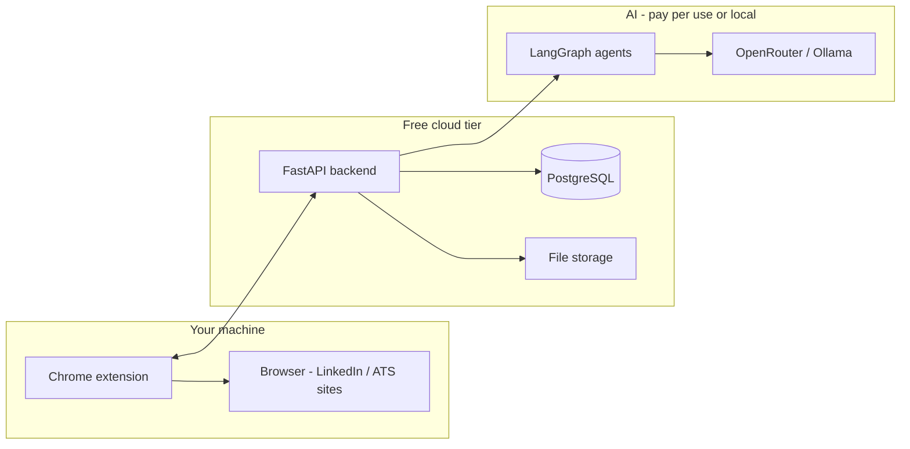
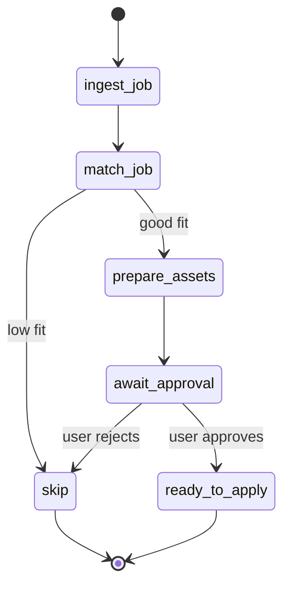

# AI Job Application Agent — Personal Project Blueprint

A practical plan to build a **personal** AI agent that helps you discover jobs, score fit, prepare materials, and apply faster — using your existing LangGraph stack and **free-tier** hosting where possible.

---

## 1. Goal

### What this project is

An **AI application copilot** that runs as your own tool (not a commercial SaaS). It should:

1. **Find** jobs that match your profile and preferences.
2. **Score** how well each role fits your background.
3. **Prepare** tailored resumes, cover letters, and screening answers (with your approval).
4. **Assist** filling application forms on job sites and ATS pages (Greenhouse, Lever, Ashby, LinkedIn Easy Apply).
5. **Track** what you applied to, when, and the outcome.

### What this project is not (for v1)

- A fully unattended bot that applies to hundreds of LinkedIn jobs per day (high ban risk, violates LinkedIn’s User Agreement).
- A multi-tenant agency platform with billing and coaches.
- Guaranteed support for every ATS (Workday is intentionally out of early scope).

### Success criteria (personal use)

| Milestone | Done when |
|-----------|-----------|
| Profile | You store one master resume + preferences in the app |
| Match | Pasting a job URL returns a fit score and short rationale |
| Prepare | You get a draft cover letter and resume tweaks you approve |
| Assist | A browser extension autofills a Greenhouse or Lever form |
| Track | Dashboard shows saved / applied / rejected jobs |

---

## 2. Design principles (personal project)

1. **Human in the loop** — You approve content before anything is submitted.
2. **Extension over server bots** — LinkedIn and most job boards are handled in *your* browser session, not by storing passwords on a cloud server.
3. **Official APIs first** — Use public job board APIs (e.g. Ashby job listings) where no login is required.
4. **Small, shippable phases** — Each phase should be usable on its own.
5. **Free tier friendly** — Avoid services that need always-on heavy compute (e.g. cloud Playwright farms).

---

## 3. High-level architecture



### Three layers

| Layer | Role | Runs where |
|-------|------|------------|
| **Dashboard** | Profile, job list, approvals, tracker | Free static host (Vercel / Cloudflare Pages) |
| **API + agents** | Auth, CRUD, LangGraph workflows | Free/low-cost PaaS (Render / Fly.io) |
| **Extension** | Detect ATS, autofill forms, send job URL to API | Your Chrome (local, free) |

---

## 4. Recommended free (or freemium) stack

### Core development (already in this repo)

| Piece | Choice | Cost |
|-------|--------|------|
| Language | Python 3.11+ | Free |
| Agents | LangGraph | Free (OSS) |
| LLM | OpenRouter (you already use this in `app/main.py`) | Pay-per-token; small personal use is cheap |
| Local LLM (optional) | [Ollama](https://ollama.com) | Free, runs on your PC |

### Hosting & data (free tiers)

| Service | Use for | Free tier notes |
|---------|---------|-----------------|
| [GitHub](https://github.com) | Code + Actions CI | Free for public/private repos |
| [Vercel](https://vercel.com) or [Cloudflare Pages](https://pages.cloudflare.com) | Next.js/React dashboard | Generous free static/SSR tier |
| [Render](https://render.com) | FastAPI backend | Free web service (sleeps after inactivity; fine for personal use) |
| [Fly.io](https://fly.io) | FastAPI (alternative) | Small free VM allowance |
| [Neon](https://neon.tech) or [Supabase](https://supabase.com) | PostgreSQL | Free Postgres |
| [Supabase Storage](https://supabase.com/storage) or [Cloudflare R2](https://www.cloudflare.com/products/r2/) | Resume PDFs | Free storage limits |
| [Upstash](https://upstash.com) | Redis / job queue (later) | Free tier for async tasks |

### Browser extension (personal use)

| Option | Cost |
|--------|------|
| Load **unpacked** extension in Chrome (`chrome://extensions`) | Free |
| Chrome Web Store publish | One-time developer fee (~$5) — only if you want public distribution |

### What to avoid on free hosting

- Running **Playwright** on Render’s free tier (slow, sleeps, memory limits). Use the extension in the browser instead.
- Storing **LinkedIn passwords** on the server. Keep session cookies in the extension only.

---

## 5. LangGraph agent design

Evolve from `app/graph_bmi.py` (linear state machine) to an **application pipeline**.

### Shared state (conceptual)

```python
class ApplicationState(TypedDict):
    job_url: str
    job_title: str
    company: str
    job_description: str
    fit_score: float
    fit_rationale: str
    resume_path: str
    cover_letter: str
    screening_answers: dict
    status: str  # discovered | matched | prepared | approved | applied | rejected
```

### Graph nodes (phases)



| Node | Responsibility |
|------|----------------|
| `ingest_job` | Fetch/paste URL, detect ATS, extract title + description |
| `match_job` | Embedding + LLM fit score vs your profile |
| `prepare_assets` | Cover letter + resume bullet suggestions (no fabricated experience) |
| `await_approval` | Pause until you confirm in dashboard or extension |
| `ready_to_apply` | Expose field map for extension autofill |

Submission itself happens in the **extension** (you click Submit), not in a headless server bot.

---

## 6. Platform strategy (personal, low risk)

| Platform | How you integrate | Automation level |
|----------|-------------------|------------------|
| **Ashby** public job boards | `GET` job board API (no auth for listings) | List jobs; open apply URL |
| **Greenhouse / Lever** | Extension autofill on careers pages | Assist only; you submit |
| **LinkedIn Easy Apply** | Extension autofill in your logged-in session | Assist only; you submit |
| **Workday** | Defer to Phase 3+ | Too complex for early MVP |

**LinkedIn reminder:** Unattended auto-apply violates their [prohibited software policy](https://www.linkedin.com/help/linkedin/answer/a1341387). For a personal project, treat LinkedIn as **autofill + tracking**, not a headless bot.

---

## 7. Proposed repository layout

Build toward this structure over time:

```
ai-agent/
├── app/
│   ├── main.py                 # API entry (FastAPI later)
│   ├── graph_bmi.py            # Keep as LangGraph learning example
│   ├── graphs/
│   │   └── application.py      # Main job application graph
│   ├── agents/
│   │   ├── ingest.py
│   │   ├── match.py
│   │   └── prepare.py
│   ├── models/                 # Pydantic schemas
│   └── services/               # DB, LLM clients
├── extension/                  # Chrome extension (TypeScript)
│   ├── manifest.json
│   ├── content.js              # ATS detection + autofill
│   └── popup.html
├── web/                        # Dashboard (optional Next.js)
├── alembic/                    # DB migrations (when you add Postgres)
├── BLUEPRINT.md                # This file
├── pyproject.toml
└── .env                        # API keys (never commit)
```

---

## 8. Implementation phases

### Phase 0 — Foundation (current → 1–2 weeks)

**Goal:** CLI or script that scores a job from a URL.

- [ ] Add Pydantic models: `Job`, `Profile`, `Application`
- [ ] `ingest_job`: parse URL, fetch page text (httpx + readability)
- [ ] `match_job`: LangGraph node calling OpenRouter
- [ ] Store results in SQLite locally (no cloud yet)

**Free cost:** $0 (local only + small LLM usage).

---

### Phase 1 — Application prep agent (2–3 weeks)

**Goal:** Generate cover letter + screening draft from your master resume.

- [ ] `prepare_assets` graph node
- [ ] Master resume as markdown or PDF text in `data/profile.json`
- [ ] Approval step: print to terminal or simple HTML page
- [ ] Export `screening_answers.json` for the extension

**Free cost:** OpenRouter tokens only.

---

### Phase 2 — Free cloud + tracker (2–3 weeks)

**Goal:** Persistent job tracker you can open anywhere.

- [ ] FastAPI: `POST /jobs`, `GET /jobs`, `PATCH /jobs/{id}`
- [ ] Neon or Supabase Postgres (free)
- [ ] Deploy API to Render (free tier)
- [ ] Simple dashboard on Vercel (list jobs, fit scores, status)

**Free cost:** $0 within free tiers; API may sleep on Render (cold start ~30s).

---

### Phase 3 — Chrome extension autofill (3–4 weeks)

**Goal:** One-click autofill on Greenhouse and Lever.

- [ ] Detect ATS from hostname (`boards.greenhouse.io`, `jobs.lever.co`)
- [ ] Map profile fields → form inputs
- [ ] “Send to agent” button: POST job URL to your API → run match graph
- [ ] Show fit score in extension popup

**Free cost:** $0 (extension runs locally).

---

### Phase 4 — LinkedIn assist + polish (ongoing)

**Goal:** Easier LinkedIn Easy Apply without ban risk.

- [ ] LinkedIn-specific content script (Easy Apply modal only)
- [ ] Daily apply cap (e.g. 10–20) and manual submit only
- [ ] Email parsing for “thank you for applying” (Gmail API optional)

---

## 9. Environment variables

```env
# .env (local — do not commit)
OPENAI_API_KEY=           # or OpenRouter key
OPENROUTER_BASE_URL=https://openrouter.ai/api/v1
MODEL=                    # e.g. openai/gpt-4o-mini

# Phase 2+
DATABASE_URL=             # Neon / Supabase connection string
API_SECRET=               # simple bearer token for your extension
```

---

## 10. Data & privacy (personal project)

Even for personal use, good habits matter:

- Keep `.env` in `.gitignore` (already standard).
- Don’t commit resumes with real phone/address to a **public** GitHub repo.
- If the API is on Render, protect it with `API_SECRET` so random people can’t call your endpoints.
- LLM providers see job text and resume content — avoid sending data you wouldn’t put in a chatbot.

---

## 11. Cost estimate (personal, light use)

| Item | Typical monthly cost |
|------|----------------------|
| Hosting (Render + Vercel + Neon) | $0 on free tiers |
| OpenRouter (fit + cover letter, ~50 jobs/month) | ~$1–5 |
| Chrome extension | $0 |
| Custom domain (optional) | ~$10/year |
| **Total** | **~$0–5/month** |

---

## 12. Risks & mitigations

| Risk | Mitigation |
|------|------------|
| LinkedIn account restriction | Extension only; you submit; low daily volume |
| LLM invents experience | Prompt: “only rephrase existing bullets”; manual review |
| Render API sleeps | Accept cold starts, or upgrade later |
| ATS UI changes | Per-site handlers; fallback to copy-paste from dashboard |
| Free tier limits | SQLite locally until you need cloud DB |

---

## 13. Immediate next steps

1. **Read** `app/graph_bmi.py` — same LangGraph patterns apply to `ApplicationState`.
2. **Create** `app/graphs/application.py` with `ingest_job` → `match_job` nodes.
3. **Test locally:** paste a Greenhouse job URL, print fit score.
4. **When ready:** add FastAPI wrapper and deploy to Render + Neon (Phase 2).

---

## 14. References

- [LangGraph docs](https://langgraph.readthedocs.io/)
- [Ashby Job Postings API](https://developers.ashbyhq.com/docs/public-job-posting-api)
- [LinkedIn prohibited software](https://www.linkedin.com/help/linkedin/answer/a1341387)
- [Render free tier](https://render.com/docs/free)
- [Neon free tier](https://neon.tech/pricing)
- [OpenRouter](https://openrouter.ai/)

---

*This blueprint is scoped for a solo personal project. Expand to multi-user or commercial use only after revisiting legal, privacy, and platform ToS requirements.*
